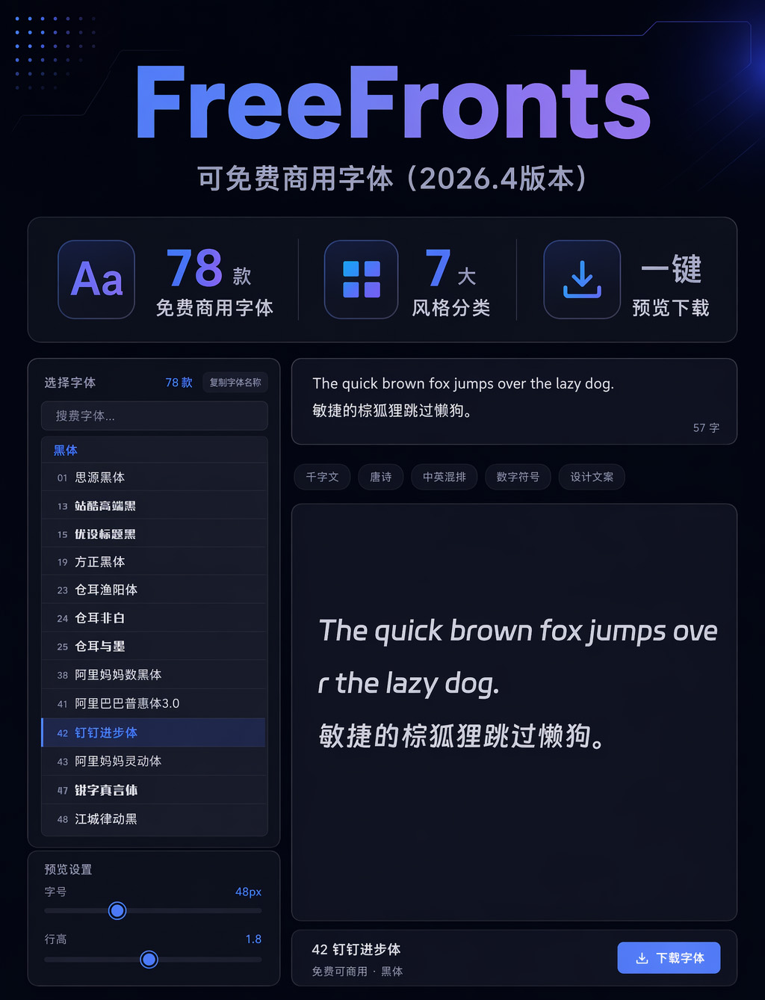

# FreeFronts

一款字体预览与下载工具，收录 **78 款可免费商用中文字体**（2026.4 版本），按风格分为 7 大类：黑体、宋体/仿宋、楷体、标题/创意、手写体、书法/艺术、圆体。

> ⚠️ **重要说明**：本仓库 **不包含** 需要官方客户端授权的字体文件（方正系列、字由系列共 7 款），相关字体信息仅用于展示和指引。用户需通过官方渠道自行获取授权后使用。

所有字体文件均自托管，无外部 CDN 依赖，浏览器打开即可使用。

## 快速开始

直接打开 [index.html](index.html) 即可使用。

## 功能特性

- ✨ **实时预览**：选择字体后即时预览效果
- 🔍 **搜索筛选**：支持按字体名称或序号快速筛选
- 📝 **自定义文本**：输入任意文字预览效果
- 🎨 **预设文案**：千字文、唐诗、中英混排、数字符号、设计文案
- 📐 **参数调节**：字号（12–200px）、行高（1.0–3.0）
- 📥 **单字体下载**：下载当前选中字体的 `.ttf` / `.otf` 文件
- 📦 **全部打包下载**：一键下载全部字体的 ZIP 包（已排除在git外，如需可自行压缩）

## 快捷键

| 快捷键 | 功能 |
|--------|------|
| `Ctrl + K` | 聚焦输入框 |

## 截图预览



## 字体分类

| 分类 | 说明 | 数量 |
|------|------|------|
| 黑体 | 现代简洁、无衬线、专业感 | 26 |
| 宋体/仿宋 | 传统印刷、衬线、正式 | 5 |
| 楷体 | 书法骨架、端庄优雅 | 7 |
| 标题/创意 | 醒目吸睛、装饰性强 | 16 |
| 手写体 | 自然随性、亲切 | 8 |
| 书法/艺术 | 毛笔/刻印风格、强烈辨识度 | 13 |
| 圆体 | 圆润柔和、可爱 | 3 |

---

## 字体授权信息

### ⚠️ 需要特定客户端授权的字体

> ❌ **本仓库未包含以下字体文件**，需用户通过官方渠道自行获取授权后使用。

| 序号 | 字体名 | 授权来源 | 获取方式 |
|------|--------|----------|----------|
| 19 | 方正黑体 | [方正字库](https://www.foundertype.com/index.php/About/powerbus.html) | 下载 [字加客户端](https://www.foundertype.com/index.php/About/powerbus.html) 获取 |
| 20 | 方正书宋 | [方正字库](https://www.foundertype.com/index.php/About/powerbus.html) | 下载 [字加客户端](https://www.foundertype.com/index.php/About/powerbus.html) 获取 |
| 21 | 方正仿宋 | [方正字库](https://www.foundertype.com/index.php/About/powerbus.html) | 下载 [字加客户端](https://www.foundertype.com/index.php/About/powerbus.html) 获取 |
| 22 | 方正楷体 | [方正字库](https://www.foundertype.com/index.php/About/powerbus.html) | 下载 [字加客户端](https://www.foundertype.com/index.php/About/powerbus.html) 获取 |
| 54 | 字由芳华体 | [字由客户端](https://www.hellofont.cn/) | 安装 [字由客户端](https://www.hellofont.cn/) 激活使用 |
| 55 | 字由文艺黑 | [字由客户端](https://www.hellofont.cn/) | 安装 [字由客户端](https://www.hellofont.cn/) 激活使用 |
| 56 | 优设字由棒棒体 | [字由客户端](https://www.hellofont.cn/) | 安装 [字由客户端](https://www.hellofont.cn/) 激活使用 |

**获取后使用方法**：将下载的字体文件放入 `fonts/` 目录，保持文件名与上述序号一致（如 `19_方正黑体.TTF`），即可在预览工具中正常使用。

### 黑体类（26款）

| 序号 | 字体名 | 授权类型 | 官方授权链接 |
|------|--------|----------|--------------|
| 01 | 思源黑体 | SIL Open Font License 1.1 | [Google Fonts](https://fonts.google.com/specimen/Noto+Sans+SC) / [Adobe Fonts](https://fonts.adobe.com/fonts/source-han-sans-cjk-simplified-chinese) |
| 11 | 站酷酷黑体 | 作者声明 | [站酷字库](https://www.zcool.com.cn/special/zcoolfonts/) |
| 13 | 站酷高端黑 | SIL Open Font License 1.1 | [站酷字库](https://www.zcool.com.cn/special/zcoolfonts/) |
| 15 | 优设标题黑 | 作者声明 | [优设网](https://www.uisdc.com/) |
| 19 | 方正黑体 | ❌ 未包含（需字加客户端授权） | [字加客户端](https://www.foundertype.com/index.php/About/powerbus.html) |
| 23 | 仓耳渔阳体 | 作者声明 | [仓耳字库](http://tsanger.cn/product/193) / [授权声明](http://tsanger.cn/%E4%BB%93%E8%80%B3%E5%AD%97%E5%BA%93%E5%85%8D%E8%B4%B9%E5%95%86%E7%94%A8%E5%AD%97%E4%BD%93%E6%8E%88%E6%9D%83%E5%A3%B0%E6%98%8E.pdf) |
| 24 | 仓耳非白 | 作者声明 | [仓耳字库](http://tsanger.cn/category/115) / [授权声明](http://tsanger.cn/%E4%BB%93%E8%80%B3%E5%AD%97%E5%BA%93%E5%85%8D%E8%B4%B9%E5%95%86%E7%94%A8%E5%AD%97%E4%BD%93%E6%8E%88%E6%9D%83%E5%A3%B0%E6%98%8E.pdf) |
| 25 | 仓耳与墨 | 作者声明 | [仓耳字库](http://tsanger.cn/product/193) / [授权声明](http://tsanger.cn/%E4%BB%93%E8%80%B3%E5%AD%97%E5%BA%93%E5%85%8D%E8%B4%B9%E5%95%86%E7%94%A8%E5%AD%97%E4%BD%93%E6%8E%88%E6%9D%83%E5%A3%B0%E6%98%8E.pdf) |
| 38 | 阿里妈妈数黑体 | 阿里官方授权 | [阿里字体库](https://www.alibabafonts.com/#/more) |
| 41 | 阿里巴巴普惠体3.0 | 阿里官方授权 | [阿里字体库](https://www.alibabafonts.com/#/font) / [授权声明](https://www.iconfont.cn/fonts/detail?cnid=adI1E7HF7yme) |
| 42 | 钉钉进步体 | 钉钉官方授权（永久免费商用） | [钉钉官网](https://page.dingtalk.com/wow/dingtalk/default/dingtalk/y-W5aF3_ZJwzulU0nceIl) / [法律声明](http://xiazaiziti.com/wp-content/uploads/2023/01/%E9%92%89%E9%92%89%E8%BF%9B%E6%AD%A5%E4%BD%93%E6%B3%95%E5%BE%8B%E5%A3%B0%E6%98%8E.pdf) |
| 43 | 阿里妈妈灵动体 | 阿里官方授权（英文字体） | [阿里字体库](https://www.alibabafonts.com/#/more) |
| 47 | 锐字真言体 | 锐字官方授权 | [锐字家族](https://www.reeji.com/) |
| 48 | 江城律动黑 | 作者声明 | [猫啃网](https://www.maoken.com/) |
| 55 | 字由文艺黑 | ❌ 未包含（需字由客户端授权） | [字由客户端](https://www.hellofont.cn/) |
| 60 | 胡晓波真帅体 | 胡晓波工作室授权 | [站酷](https://www.zcool.com.cn/work/ZNDE3NjcwMTY=.html) |
| 61 | 胡晓波骚包体 | 胡晓波工作室授权 | [站酷](https://www.zcool.com.cn/work/ZNDE3NjcwMTY=.html) |
| 62 | 胡晓波男神体 | 胡晓波工作室授权 | [站酷](https://www.zcool.com.cn/work/ZNDE3NjcwMTY=.html) |
| 63 | 猫啃什锦黑 | 作者声明 | [猫啃网](https://www.maoken.com/) |
| 65 | 联盟起艺卢帅正锐黑体 | 作者声明 | [联盟起艺](https://www.uniontype.com/) |
| 69 | 仓迹高德国妙黑 | 作者声明 | [找字体](https://zfont.cn/) |
| 70 | 得意黑（Smiley Sans） | SIL Open Font License 1.1 | [GitHub](https://github.com/atelier-anchor/smiley-sans) / [许可证](https://github.com/atelier-anchor/smiley-sans/blob/main/LICENSE) |
| 75 | 字体圈欣意冠黑体4.0 | 字体圈官方授权 | [字体圈](https://www.zitiq.com/) |
| 76 | Aa厚底黑 | 作者声明 | [找字体](https://zfont.cn/) |
| 77 | OPPO Sans 4.0 | OPPO官方授权 | [OPPO开放平台](https://open.oppomobile.com/documentation/page/info?id=13223) / [官方说明](https://www.coloros.com/article/A00000074/) |

### 宋体/仿宋类（5款）

| 序号 | 字体名 | 授权类型 | 官方授权链接 |
|------|--------|----------|--------------|
| 02 | 思源宋体 | SIL Open Font License 1.1 | [Google Fonts](https://fonts.google.com/specimen/Noto+Serif+SC) / [Adobe Fonts](https://fonts.adobe.com/fonts/source-han-serif-cjk-simplified-chinese) |
| 20 | 方正书宋 | ❌ 未包含（需字加客户端授权） | [字加客户端](https://www.foundertype.com/index.php/About/powerbus.html) |
| 21 | 方正仿宋 | ❌ 未包含（需字加客户端授权） | [字加客户端](https://www.foundertype.com/index.php/About/powerbus.html) |
| 71 | 飞花宋体 | 作者声明 | [找字体](https://zfont.cn/) |
| 72 | 猴尊宋体 | 作者声明 | [找字体](https://zfont.cn/) |

### 楷体类（7款）

| 序号 | 字体名 | 授权类型 | 官方授权链接 |
|------|--------|----------|--------------|
| 22 | 方正楷体 | ❌ 未包含（需字加客户端授权） | [字加客户端](https://www.foundertype.com/index.php/About/powerbus.html) |
| 32 | 演示悠然小楷 | 作者声明 | [Keynote研究所](https://www.keyoou.com/) |
| 33 | 演示夏行楷 | 作者声明 | [演示字体](https://www.keyoou.com/) |
| 34 | 演示春风楷 | 作者声明 | [演示字体](https://www.keyoou.com/) |
| 35 | 演示秋鸿楷 | 作者声明 | [演示字体](https://www.keyoou.com/) |
| 37 | 阿里妈妈东方大楷 | 阿里官方授权 | [阿里字体库](https://www.alibabafonts.com/#/more) |
| 51 | 三极行楷简体-粗 | 三极字库授权 | [三极字库](https://www.sanjige.com/) |

### 标题/创意类（16款）

| 序号 | 字体名 | 授权类型 | 官方授权链接 |
|------|--------|----------|--------------|
| 03 | 庞门正道标题体 | SIL Open Font License 1.1 | [庞门正道公众号](https://mp.weixin.qq.com/s/PyTUQeZ3mS7XSyvfUEFI-A) |
| 04 | 庞门正道标题体免费版 | 作者声明 | [庞门正道公众号](https://mp.weixin.qq.com/s/PyTUQeZ3mS7XSyvfUEFI-A) |
| 07 | 庞门正道细线体 | 作者声明 | [字趣星球](https://www.ziqufont.com/3884.html) |
| 08 | 站酷庆科黄油体 | 作者声明 | [站酷字库](https://www.zcool.com.cn/special/zcoolfonts/) |
| 09 | 站酷文艺体 | 作者声明 | [站酷](https://www.zcool.com.cn/article/ZMTIxMjE1Ng==.html) |
| 10 | 站酷小薇LOGO体 | 作者声明 | [站酷](https://www.zcool.com.cn/) |
| 12 | 站酷快乐体 | 作者声明 | [站酷字库](https://www.zcool.com.cn/special/zcoolfonts/) |
| 17 | 优设好身体 | 优设官方授权 | [优设网](https://www.uisdc.com/) |
| 18 | 优设鲨鱼菲特健康体 | 优设官方授权 | [优设网](https://www.uisdc.com/) |
| 27 | 仓耳小丸子 | 作者声明 | [仓耳字库](http://tsanger.cn/) / [授权声明](http://tsanger.cn/%E4%BB%93%E8%80%B3%E5%AD%97%E5%BA%93%E5%85%8D%E8%B4%B9%E5%95%86%E7%94%A8%E5%AD%97%E4%BD%93%E6%8E%88%E6%9D%83%E5%A3%B0%E6%98%8E.pdf) |
| 53 | 抖音美好体 | 抖音官方授权 | [找字体](https://zfont.cn/) |
| 56 | 优设字由棒棒体 | ❌ 未包含（需字由客户端授权） | [字由客户端](https://www.hellofont.cn/) |
| 66 | 创客贴金刚体 | 创客贴官方授权 | [创客贴](https://www.chuangkit.com/) |
| 67 | 快看世界体 | 快看世界官方授权 | [快看漫画](https://www.kuaikanmanhua.com/) |
| 68 | 小可奶酪体 | 作者声明 | [找字体](https://zfont.cn/) |
| 73 | 美呗嘿嘿体 | 作者声明 | [找字体](https://zfont.cn/) |

### 手写体类（8款）

| 序号 | 字体名 | 授权类型 | 官方授权链接 |
|------|--------|----------|--------------|
| 05 | 庞门正道真贵楷体 | 作者声明 | [庞门正道公众号](https://mp.weixin.qq.com/s/bQxB8CdWgqx9hWO_z343gg) / [猫啃网](https://www.maoken.com/freefonts/8679.html) |
| 29 | 鸿雷板书简体 | 作者声明 | [猫啃网](https://www.maoken.com/) |
| 30 | 鸿雷行书简体 | 作者声明 | [猫啃网](https://www.maoken.com/) |
| 31 | 鸿雷拙书简体 | 作者声明 | [猫啃网](https://www.maoken.com/) |
| 36 | 演示佛系体 | Keynote研究所&秋叶PPT联合发布 | [Keynote研究所](https://www.keyoou.com/) |
| 44 | 手书体 | 作者声明 | [猫啃网](https://www.maoken.com/) |
| 45 | 沐瑶软笔手写体 | 作者声明 | [猫啃网](https://www.maoken.com/) |
| 50 | 字制区喜脉体 | 作者声明 | [字体家](https://www.zitijia.com/) |

### 书法/艺术类（13款）

| 序号 | 字体名 | 授权类型 | 官方授权链接 |
|------|--------|----------|--------------|
| 06 | 庞门正道粗书体 | 作者声明 | [字趣星球](https://www.ziqufont.com/3896.html) |
| 28 | 仓耳周珂正大榜书 | 作者声明 | [仓耳字库](http://tsanger.cn/) / [授权声明](http://tsanger.cn/%E4%BB%93%E8%80%B3%E5%AD%97%E5%BA%93%E5%85%8D%E8%B4%B9%E5%95%86%E7%94%A8%E5%AD%97%E4%BD%93%E6%8E%88%E6%9D%83%E5%A3%B0%E6%98%8E.pdf) |
| 39 | 阿里妈妈刀隶体 | 阿里官方授权 | [阿里字体库](https://www.alibabafonts.com/#/more) |
| 46 | 杨任东竹石体 | 作者声明 | [猫啃网](https://www.maoken.com/) |
| 49 | 江西拙楷 | 作者声明 | [字由](https://www.hellofont.cn/) |
| 54 | 字由芳华体 | ❌ 未包含（需字由客户端授权） | [字由客户端](https://www.hellofont.cn/) |
| 57 | 云峰飞云体 | 作者声明 | [猫啃网](https://www.maoken.com/) |
| 58 | 云峰寒蝉体 | 作者声明 | [猫啃网](https://www.maoken.com/) |
| 59 | 云峰重庆山城棒棒体 | 作者声明 | [猫啃网](https://www.maoken.com/) |
| 64 | 飞波正点体 | 作者声明 | [猫啃网](https://www.maoken.com/) |
| 74 | 润植家刻本简体 | 作者声明 | [猫啃网](https://www.maoken.com/) |
| 78 | 字魂扁桃体 | 字魂官方授权 | [字魂网](https://www.znzht.com/) |
| 79 | 中华薪火体 | 作者声明 | [找字体](https://zfont.cn/) |

### 圆体类（3款）

| 序号 | 字体名 | 授权类型 | 官方授权链接 |
|------|--------|----------|--------------|
| 16 | 优设标题圆 | 优设官方授权 | [优设网](https://www.uisdc.com/) |
| 26 | 仓耳舒圆体 | 作者声明 | [仓耳字库](http://tsanger.cn/) / [授权声明](http://tsanger.cn/%E4%BB%93%E8%80%B3%E5%AD%97%E5%BA%93%E5%85%8D%E8%B4%B9%E5%95%86%E7%94%A8%E5%AD%97%E4%BD%93%E6%8E%88%E6%9D%83%E5%A3%B0%E6%98%8E.pdf) |
| 40 | 阿里妈妈方圆体 | 阿里官方授权 | [阿里字体库](https://www.alibabafonts.com/#/more) |

---

## 字体授权查询推荐网站

在使用字体前，建议通过以下网站二次确认授权状态：

- [字由](https://www.hellofont.cn/) - 字体管理与授权验证平台
- [猫啃网](https://www.maoken.com/all-fonts) - 免费商用字体收录
- [找字体](https://zfont.cn/allfonts.html) - 字体搜索与授权查询
- [字体天下](https://www.fonts.net.cn) - 字体下载与授权说明
- [GitHub - wordshub/free-font](https://github.com/wordshub/free-font) - 免费字体汇总

---

## 添加新字体

在 `index.html` 的 `<script>` 中找到 `var fonts=[...]` 数组，按以下格式添加：

```js
{id:'f80',num:'80',name:'新字体名',cat:'hei',file:'fonts/80_新字体.ttf',ext:'truetype'},
```

`cat` 可选值：`hei`（黑体）、`song`（宋体）、`kai`（楷体）、`title`（标题）、`hand`（手写）、`art`（书法）、`round`（圆体）。

同时在 `<style>` 中添加对应的 `@font-face` 声明：

```css
@font-face {
  font-family: '新字体名';
  src: url('fonts/80_新字体.ttf') format('truetype');
  font-weight: normal;
  font-style: normal;
  font-display: swap;
}
```

---

## 部署说明

1. 将整个 `FreeFronts` 文件夹放到 Web 服务器目录下
2. 确保 `fonts/` 子目录中的所有字体文件可被服务器读取（权限 644）
3. 访问 `index.html` 即可使用

无需 Node.js、PHP 或数据库——纯静态 HTML 页面。

---

## 重要声明

⚠️ **使用字体前，请务必确认其授权状态**。本项目收录的字体均标注为"免费可商用"，但版权归原作者/发布方所有。请在使用前通过官方链接再次确认授权条款，确保合规使用。

> ❌ **本仓库未包含的字体**：方正系列（序号19-22）和字由系列（序号54-56）共7款字体因需官方客户端授权，已从仓库中排除。如需使用，请通过上述官方渠道自行获取授权后将字体文件放入 `fonts/` 目录。

---

## 项目结构

```
FreeFronts/
├── fonts/                    # 字体文件目录（71款可直接使用）
│   ├── 01_思源黑体_Regular.ttf
│   ├── 02_思源宋体_Regular.ttf
│   └── ... (方正系列、字由系列共7款未包含)
├── index.html               # 主页面（字体预览工具）
├── README.md                # 项目说明（本文件）
├── FONT_REPORT.md           # 字体收录报告
├── 使用说明.md              # 使用说明
├── fonts_all.zip            # 全部字体打包（已排除在git外）
├── .gitignore               # Git 忽略规则（排除风险字体和ZIP包）
└── lookme.jpg               # 截图
```

**Git 忽略的文件**（`.gitignore`）：
- `fonts_all.zip` — 全部字体打包文件（约290MB）
- `fonts/19_方正黑体.TTF`、`fonts/20_方正书宋.TTF`、`fonts/21_方正仿宋.TTF`、`fonts/22_方正楷体.TTF` — 方正系列字体（需字加客户端授权）
- `fonts/54_字由芳华体.otf`、`fonts/55_字由文艺黑.otf`、`fonts/56_优设字由棒棒体.otf` — 字由系列字体（需字由客户端激活）

## License

本项目代码（HTML/CSS/JS）为 MIT License。字体文件版权归各自发布方所有，详见上方授权信息。

## 关注我

**点赞 收藏 散会**

[快手](https://v.kuaishou.com/5eo8Cv)

[抖音]( https://v.douyin.com/CeiJMCp3o)

[小红书](https://www.xiaohongshu.com/user/profile/60ed03f7000000000100bf52)

[哔哩](https://b23.tv/jITjmL8)

